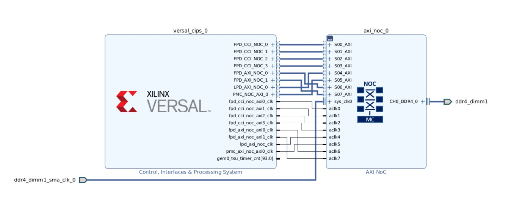

<tr>
   <td align="center"><h1>2022.1 Versal Example Design: USB as secondary boot device</h1>
   </td>
 </tr>
</table>

# Table of Contents

1. [Introduction](#introduction)

2. [Before You Begin](#before-you-begin)

3. [Building Hardware Design](#building-hardware-design)

4. [Building Software Design](#building-software-design)

5. [Generate boot images](#Generate boot images)

6. [Running the design](#Running the design)

# Introduction
Versal™ ACAP combines adaptable processing and acceleration engines with programmable logic and configurable connectivity to enable custom, heterogeneous hardware solutions for a wide variety of applications in Data Center, automotive, 5G wireless, wired network, and defense. Versal ACAP supports several secondary boot modes for application flexibility. This tutorial highlights the way to use USB as secondary boot device.
	
## Objectives
This example is going to demonstrate how to modify bif to load second PDI via USB in 2022.1. VCK190 will be used for demonstration. We will use SD card as first boot device to load PLM, and use USB as secondary boot device to load the other partitions(A72 helloworld applications or u-boot)

## Design Block Diagram


## Directory Structure
<details>
<summary> Tutorial Directory Details </summary>

```
USB_Boot
|___Design.................Contains Design files
  |___Hardware.........................Contains Hardware Design files
  |___Software/Vitis...................Contains Vitis Design files
    |___bif............................Contains boot image format files
    |___src............................Contains Software source files
|___Figures................Contains figures that appear in README.md
  |___add_config_device.png............Add Configuration Memory Device
  |___block.png........................Block Diagram
  |___prog_config_device.png...........Program Configuration Memory Device
  |___time_estimator.png...............Time Estimator
|___Scripts................Contains TCL scripts to generate reference Design, PDI, etc...
  |___create_vivado_project.tcl.........Generates the Vivado Design
  |___deisgn_bd.tcl.....................Generates the VVivado Block Diagram
  |___vck190_vitis_app.tcl..............Generates the Vitis applicaion project
  |___vck190_vitis_plm.tcl..............Generates the Vitis plm project
|___README.md...............Includes tutorial overview, steps to create reference design, and debug resources
```
</details>

# Before You Begin

Recommended general knowledge of:
* VCK190 evaluation board
* Versal PMC
* Xilinx Vivado Design Suite 
* Xilinx Vitis IDE
* Xilinx petalinux tools

<details>
<summary> Key  Reference Documents </summary>

* VCK190 Evaluation Board User Guide [(UG1366)](https://docs.xilinx.com/r/en-US/ug1366-vck190-eval-bd)
* Versal ACAP System Software Developers Guide [(UG1304)](https://docs.xilinx.com/r/en-US/ug1304-versal-acap-ssdg)
* Bootgen User Guide [(UG1283)](https://docs.xilinx.com/r/en-US/ug1283-bootgen-user-guide)

</details>


#### Hardware Requirements:

* Host machine with an operating system supported by Vivado Design Suite and Vitis 2021.1
* VCK190 Evaluation Board, which includes:
  * Versal ACAP XCVC1902-2VSVA2197
  * AC power adapter (100-240VAC input, 12VDC 15.0A output).
  * System controller microSD card in socket (J302).
  * USB Type-C cable (for JTAG and UART communications).
  * USB 2.0 type A connector (J308).
* Board setup: Connect VCK190 J308 to PC host with USB cable; Set SW1[1:4] to 0111(up, down, down, down) as sd boot mode.

#### Software Requirements:
In order to build and run the tutorial reference design, the following must be available or installed:
  * Vivado Design Suite, Vitis, and petalinux 2022.1:
  	- Visit https://www.xilinx.com/support/download.html for the latest tool version.
  	- For more information on installing the Vivado Design Suite and Vitis, refer to [UG1400 Vitis Unified Software Platform Embedded Software Development](https://docs.xilinx.com/r/en-US/ug1400-vitis-embedded).
   * VCK190 board support package 2022.1 [(VCK190 BSP)](https://www.xilinx.com/member/forms/download/xef.html?filename=xilinx-vck190-v2022.1-04191534.bsp).
  * Scripts to generate the reference design are provided in the `Scripts` directory 

    
# Building Hardware Design  

## Vivado steps
Be sure to source `settings.sh` for Vivado.
Enter the `Scripts` directory. From the command line run the following:
```
vivado -source create_vivado_project.tcl
```
The Vivado project `vck190_ddr4` will be created and built in the `Hardware` directory. A .xsa file will be generated in Vivado project directory.

# Building Software Design 

## Vitis steps
Open XSCT and change working directory to `Scripts`. Run below command to create a vitis project generating plm.elf needed by usb booting.
```
source vck190_vitis_plm.tcl
```
A Vitis workspace will be created and built in the `Software/Vitis/prj_plm` directory.
#### **NOTE**:
The PLM generated by vivado does not support USB as secondary boot device, while in vitis we can generate a PLM we want by PLM Feature Configuration. 

Don't close XSCT, run below command to create an application running on the APU.
```
source vck190_vitis_app.tcl
```
Another Vitis workspace will be created and built in the `Software/Vitis/prj_app` directory.

Launch the Vitis software platform and set the workspace path to `Software/Vitis/prj_app`.

Copy helloworld.c file in the `Software/Vitis/src` folder to `Software/Vitis/prj_app/hello_a72_0/src`, and then rebuild the project.

#### **NOTE**:
The modified `helloworld.c` is to add some delays before printing helloworld. This is because when A72 is printing helloworld, PLM may not release the control of UART, so helloworld may not be seen in the console. So in this example, 5 seconds delay is added before printing helloworld.

## Petalinux steps
1. Be sure to source `settings.sh` for 2022.1 Petalinux. Enter `Software/Petalinux` directory.

2. Create a new Petalinux project based on release VCK190 BSP 
```
petalinux-create -t project -s <Directory-to-BSP>/xilinx-vck190-v2022.1-<your_bsp_version>.bsp -p ../Software/Petalinux/ -n vck190_plnx
```
3. Import the generated xsa file
```
cd ../Software/Petalinux/
petalinux-config --get-hw-description=../../Hardware/vck190_ddr4/ --silentconfig
```
4. Build Petalinux project
```
petalinux-build
```

# Generate boot images

## Generate the primary boot image
The primary boot image is used to boot plm from primary boot device, in this example, it is microSD card. The simplest method to generate the primary boot image is to modify the generated bif in vivado and then generate pdi again. User can look for the bif file that Vivado uses to generate PDI at <vivado project>/ <vivado project>.runs/impl_1/ *.bif, and then add "boot_device {usb}" to this bif, which would let PLM know that USB is the secondary boot device.
```
new_bif:
{
 ...
 id = xxx
 boot_device {usb}
 image
 {
  ...
 }
}
```  
 
- steps to generate primary boot image in this example (all bif files are located in `Software/bif` directory)
 1. Copy a72_primary.bif(You can make your own using the above method) to Hardware/vck190_ddr4/vck190_ddr4.runs/impl_1/
 2. Copy plm.elf in `Software/Vitis/prj_plm/plm/Debug` to `Hardware/vck190_ddr4/vck190_ddr4.runs/impl_1/gen_files/`
 3. Open XSCT, and change working directory to `Hardware/vck190_ddr4/vck190_ddr4.runs/impl_1/`
 4. Run below command to generate primary boot image: boot_primary.bin
 ```sh
 bootgen -arch versal -image a72_primary.bif -w -o boot_primary.bin
 ```
 
## Generate the secondary boot image for A72 helloworld
The second bif is used to generate pdi which contains helloworld appliation and is loaded via USB DFU.
1. Copy a72_secondary_helloworld.bif to `Software/Vitis/prj_app/hello_a72_0/Debug/`
2. Change directory to `Software/Vitis/prj_app/hello_a72_0/Debug/`
3. Open XSCT and generate secondary boot image for helloworld application by running below Bootgen command in XSCT:
```sh
bootgen -arch versal -image a72_secondary_helloworld.bif -w -o boot_secondary_helloworld.bin
```
## Generate the secondary boot image for u-boot 
1. Copy a72_secondary_u-boot.bif to `Software/Petalinux/vck190_plnx/images/linux/`
2. Change directory to `Software/Petalinux/vck190_plnx/images/linux/` 
3. Open XSCT and generate secondary boot image for helloworld application by running below Bootgen command in XSCT:
```sh
bootgen -arch versal -image a72_secondary_u-boot.bif -w -o boot_secondary_u-boot.bin
```

# Running the design
## UART serial terminal recommended:
Vitis serial Terminal or a terminal emulator program for UART (i.e. Putty or MobaXterm) can be used to display valuable PLM log boot status.

When UART is not available, Vivado Design Suite and Vitis xsct/xsdb command line tools can be used to read the plm log after a boot attempt.
## Running the Design
1. Change the name of boot_primary.bin to boot.bin, then copy it to MicroSD card, and then boot up VCK190 with MicroSD.
2. PLM should wait for secondary image after printing below messages
```sh
[11833.689453]Loading PDI from USB
[11836.709006]Monolithic/Master Device
```
3. Loading secondary image by dfu-util in PC host
- If loading A72 helloworld application, copy boot_secondary_helloworld.bin to host and run below commands to download secondary image to VCK190
```sh
sudo dfu-util -l
sudo dfu-util -D boot_secondary_helloworld.bin
```


